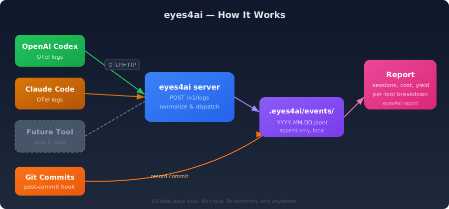

eyes4ai is a passive AI activity recorder for Git repositories. It silently captures how AI coding tools (Codex, Claude Code, and others) are used in your repos — token usage, costs, tool calls, and session data — and correlates that activity with your Git commits.

<video src="/demo.mp4" autoplay loop muted playsinline style="width:100%;border-radius:8px;margin:20px 0;"></video>

## How it works

## The problem

You use AI coding tools daily. You have no idea how much they cost, how productive they are, or which sessions led to actual committed code versus abandoned experiments.

## What eyes4ai does

After a one-time install, eyes4ai runs invisibly in the background:

- **Records AI activity** via OpenTelemetry — prompts, token usage, tool calls, costs
- **Correlates with Git commits** — which AI sessions led to which commits
- **Generates yield reports** — session-to-commit rate, cost per commit, abandoned sessions, trends

You keep using your AI tools normally. eyes4ai just listens.

## Design principles

- **Zero ceremony.** Install once, then forget about it. No commands to remember.
- **Privacy-preserving.** Prompt hashes, not raw prompts. Sensitive data is redacted by default.
- **Local-first.** All data stays in your repo under `.eyes4ai/private/`. Nothing leaves your machine.
- **Tool-agnostic.** Works with Codex, Claude Code, and any tool that speaks OpenTelemetry.
